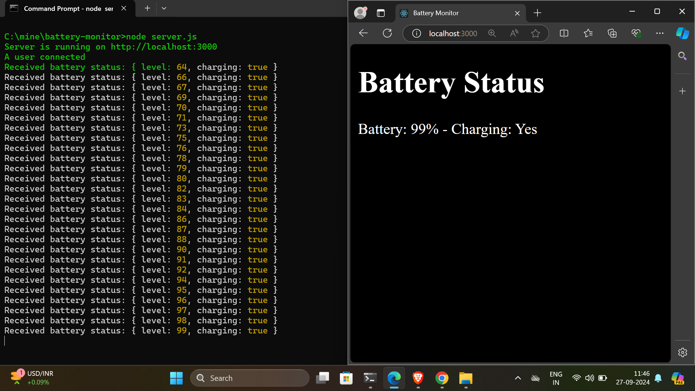
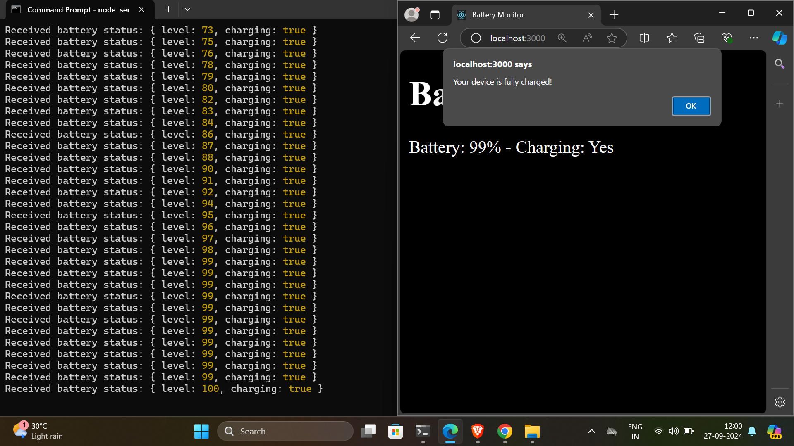
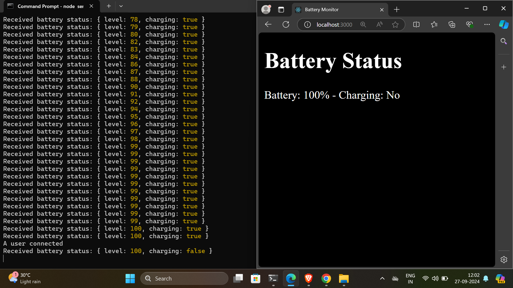

# Battery Monitor Web App

This project monitors your phone's battery percentage and charging status using a web app.

## Features
- Displays current battery level and charging status.
- Alerts when the device is fully charged.

## Setup Instructions

1. **Install Node.js** if you haven’t already.
2. **Clone the repository** and navigate to the project directory.

```bash

git clone <repository-url>
cd battery-monitor

```

# Output:





